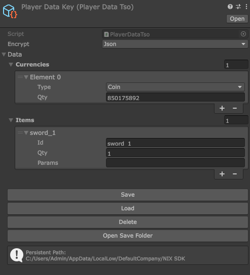
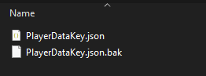

# Giới Thiệu
Module này cung cấp một hệ thống lưu trữ dữ liệu local đơn giản và hiệu quả, sử dụng ScriptableObject để chỉnh sửa dữ liệu realtime trên Unity Editor. Bạn có thể dễ dàng quản lý và truy cập dữ liệu của mình thông qua `StorageService`, đồng thời đảm bảo an toàn cho dữ liệu với các phương thức mã hóa tích hợp sẵn.

Module này sử dụng `Newtonsoft.json` để serialize và deserialize dữ liệu nên bạn có thể sử dụng `Dictionary` hoặc các cấu trúc dữ liệu phức tạp khác mà không gặp vấn đề gì. Ngoài ra, module cũng hỗ trợ nhiều phương thức mã hóa khác nhau như Json, Base64, Xor, Aes để bảo vệ dữ liệu của bạn khỏi bị truy cập trái phép.
# Mục lục
- [Cài Đặt](#cài-đặt)
- [Sử Dụng](#sử-dụng)
  - [StorageService](#storageservice)
  - [BaseDataSO](#basedataso)
  - [BaseDataTSO](#basedatatso)
- [Best Practice](#best-practice)
- [Dependencies](#dependencies)

## Cài Đặt
- Cài đặt qua git URL: 
```text 
https://github.com/tien-champion/com.cp.storage.service.git#main 
```
- Download ở [`Releases`](https://github.com/tien-champion/com.cp.storage.service/releases) và import vào thư mục `Assets`.

## Sử Dụng
Module này nằm trong namespace `Champion`, để sử dụng, bạn cần kế thừa một trong hai class:

- `BaseDataSO`
- `BaseDataTSO<T>`

Hai class này cung cấp các phương thức Save/Load dữ liệu và giao diện ScriptableObject để chỉnh sửa realtime.

Sử dụng `StorageService` để quản lý và truy cập tất cả `BaseDataSO`, `BaseDataTSO<T>` trong game của bạn ở bất kỳ đâu.


## StorageService
Class này quản lý tất cả BaseDataSO mà bạn đã đăng ký.
- Để Register gọi: `StorageService.Register(BaseDataSO dataSO)`
- Để lấy Data đã đăng ký: `StorageService.Get<T>()` (T là class kế thừa từ BaseDataSO)
- Để kiểm tra xem đã đăng ký chưa: `StorageService.IsRegistered<T>()`
- Để huỷ đăng ký: `StorageService.Unregister<T>()`

Ví dụ:

```csharp
// Best practice là bạn lưu tất cả trong một thư mục trong Resources
// Sau đó load tất cả trong lúc Init game và đăng ký vào StorageService
using UnityEngine;

[DefaultExecutionOrder(-100)] //Đảm bảo Awake của GameManager chạy trước các script khác
public class GameManager : MonoBehaviour
{
    private void Awake()
    {
        var storages = Resources.LoadAll<BaseDataSO>("LocalData"); // Thay bằng đường dẫn folder chứa file data của bạn
        foreach (var storage in storages)
        {
            storage.Load(); //Load dữ liệu được lưu hoặc tạo mới, các giá trị set trên SO sẽ là giá trị default của Data đó
            StorageService.Register(storage);
        }
    }
}
```
## BaseDataSO
Class này cung cấp giao diện ScriptableObject trên Inspector để edit dữ liệu realtime.

- `Encrypt` chọn các cách mã hoá: `Json, Base64, Xor, Aes` thông qua enum `DataEncryptionType` trong class này.
- Quản lý thông qua các phương thức: `Save()`, `Load()`, `Delete()`.
- File được lưu sẽ có đuôi là .json, trên Window sẽ mặc định format là Json để dễ debug.
- Tự động tạo 1 file .bak để làm backup cho dữ liệu, nếu có lỗi khi lưu sẽ tự động khôi phục lại dữ liệu từ file .bak này.
## BaseDataTSO
Bạn có thể triển khai nhanh bằng cách kế thừa class này.
- Kế thừa từ `BaseDataSO` và nhận vào 1 class dữ liệu thông qua generic type `T`.
- Tự động lấy `ScriptableObject.name` làm key để lưu dữ liệu.
- Sử dụng _Data mặc định trên SO làm Default khi dữ liệu chưa được khởi tạo trước đó.

Ví dụ:
```csharp
using System.Collections.Generic;

[System.Serializable] //Đảm bảo có thuộc tính này để có thể hiện trên Inspector
public class PlayerInventory // Class dữ liệu
{
    public List<Currency> Currencies;
    public List<Item> Items;
}
```

```csharp
[CreateAssetMenu(fileName = "PlayerDataKey", menuName = "PlayerDataKey")]
public class PlayerDataKeySO : BaseDataTSO<PlayerInventory> // -> Generic class data
{
    public void AddCurrency(Currency currency)
    {
        if (!this._Data.Currencies.Contains(currency))
        {
            this._Data.Currencies.Add(currency);
            this.Save();
            // Raise event...
        }
    }
}
```
Tiếp theo tạo file SO trong thư mục Resources/LocalData (hoặc thư mục bạn đã đặt). Bạn sẽ thấy giao diện để chỉnh sửa realtime trên Inspector như thế này:

<p align="center">
  
</p>

Sau khi Save bạn sẽ có 2 file như thế này:

<p align="center">
  
</p>

Sau đó, ở bất kỳ đâu bạn có truy cập đến class SO này thông qua StorageService:
```csharp
StorageService.Get<PlayerDataKeySO>().AddCurrency(new Currency()
    {
        Qty = 257000
    }
);
```
## Best Practice
- Tạo class `PlayerData` và thêm `[System.Serializable]` để chứa các thuộc tính dữ liệu của người chơi.
- Tạo class `PlayerDataSO` kế thừa từ `BaseDataTSO<PlayerData>`, triển khai các phương thức để chỉnh sửa dữ liệu.
- Tạo file `PlayerDataSO` trong thư mục Resources/LocalData.
- Trong GameManager đặt `[DefaultExecutionOrder(-100)]` để `Awake` chạy trước các script khác
- Load tất cả file SO trong thư mục `Resources/LocalData` và đăng ký vào `StorageService` ở hàm Awake của `GameManager`.
- Sử dụng `StorageService.Get<PlayerDataSO>()` để truy cập và chỉnh sửa dữ liệu người chơi ở bất kỳ đâu trong game.
- Sử dụng event hoặc callback để thông báo khi dữ liệu thay đổi, giúp cập nhật UI hoặc các hệ thống liên quan một cách hiệu quả.

## Dependencies
- `"com.unity.nuget.newtonsoft-json": "3.2.1"`: Serialize/Deserialize dữ liệu thành JSON, hỗ trợ mã hóa và giải mã dữ liệu một cách dễ dàng.
